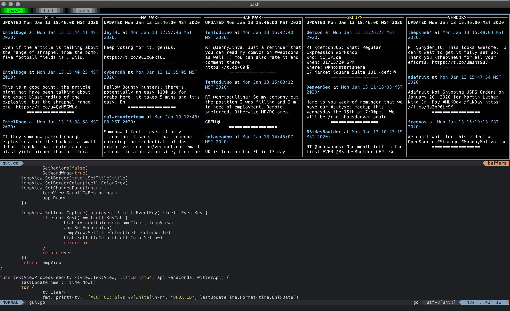

# About

I follow a bunch of people who span a bunch of topics and wanted a way to keep track of all the cool stuff they post.
I figured there would certainly be a read-only type tool to just stream tweets for you to view. I wasn't able to find anything
which is why I created this.

Tweetdeck was the first thing I went to, but it was kind of clunky and I couldn't get over the set column width thing.
Maybe I'm just dumb, but it didn't feel right to me. The fact that you needed to run it in a web browseer was also not ideal.

For that reason I hacked this thing together. It gives me the ability to watch tweets stream by in my terminal while I'm working.
Think of it like a monitoring dashboard or something, only for tweets :).

The app leans heavily on Twitter "lists". Each list should be a grouping of similar topics, say "sports" or "world news" or whatever.
In the app, each list will have a dedicated column which will only display tweets from members of that list. I use private lists
as a way to organize who I follow, but the list doesn't have to be private for things to work.

# Install/Setup

Before you begin, you'll need a twitter dev account as you'll need to be able to interact with the twitter API. Once you have that, you
can populate the config file with your access token(s).

To install, ~~you can either download a compiled executable from the releases page,~~ or, if you have go installed, do your typical go get:

`go get github.com/esell/twitterMon`

*NOTE*: sqlite is used for storage and the sqlite library I use depends on cgo.

Currently there are a few manual steps that need to be done for this POS to work. These steps assume you do NOT have any existing lists that
you want to use.

1. Create a `lists.csv` file with the names of each list you want to create. Each name should be on its own line. There is an example in this repo.
2. Run `./twitterMon -f > out.csv` to generate a list of people you follow.
3. Now the fun part. Open up `out.csv` and add a third value for each row, this will be the list you want to assign the account to. Again, the repo has an example of this. It is important that you use the same list names from `list.csv`, otherwise the app won't be able to map everything correctly.
4. Run `./twitterMon -n -l` to create the database structure, create the lists and then add accounts to each list based on the mapping from `out.csv`.
5. Now you need to setup your config with the lists you want to display in the app. You'll need the list name and the list ID, which you can dump with `./twitterMon -d`. repo == example.
6. Run `/.twitterMon` and enjoy. The `tab` key cycles through the columns, and the typical up/down (or pgup/pgdn) will scroll through the column.

